# Software Studio 2018 Spring Midterm Project
## Notice
* Replace all [xxxx] to your answer

## Topic
* Shopping website
* Key functions (add/delete)
    1. Product page
    2. shopping pipeline
    3. user dashboard 

* Other functions (add/delete)
    1. home page
    2. about page
    3. contact page
    4. footer

## Basic Components
|Component|Score|Y/N|
|:-:|:-:|:-:|
|Membership Mechanism|20%|Y|
|GitLab Page|5%|Y|
|Database|15%|Y|
|RWD|15%|Y|
|Topic Key Function|15%|Y|

## Advanced Components
|Component|Score|Y/N|
|:-:|:-:|:-:|
|Third-Party Sign In|2.5%|Y|
|Chrome Notification|5%|Y|
|Use CSS Animation|2.5%|Y|
|Security Report|5%|Y|
|Other functions|1~10%|Y|

## Website Detail Description
* 使用到的Template

    <a href="http://sc.chinaz.com/moban/">Template</a> 使用在這網站的一個template參考來當主頁

    <a href="https://colorlib.com/wp/html5-and-css3-login-forms/">Signin</a> Login page 是參考這裡的template
* 登入畫面

    * 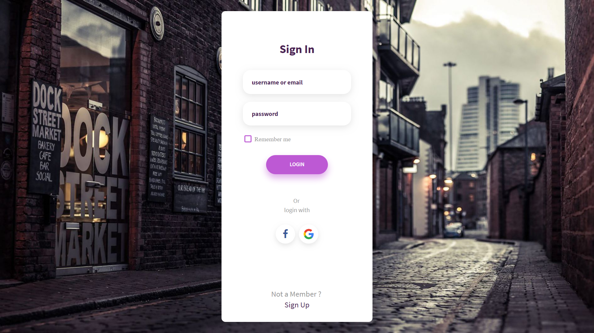
    
    1. Email / Password Login
    2. Google Login
    3. Facebook Login
    4. Remember Me
    5. Sign Up

* 主頁畫面 (Can be regarded as Other functions)

    * 
     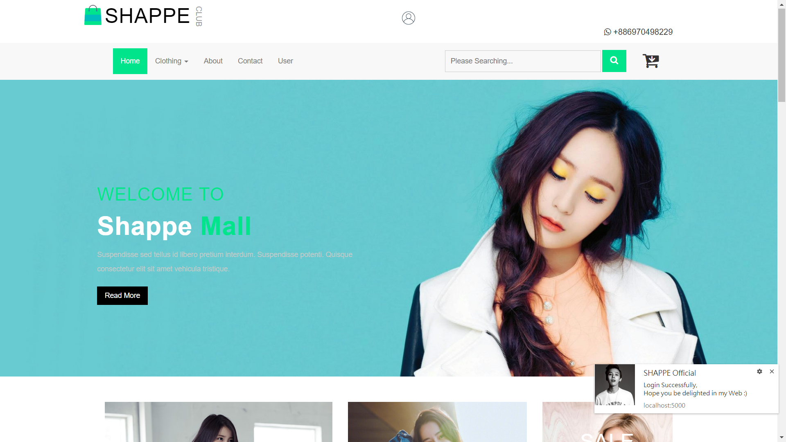
    
    1. 最上面中間是帳戶，可以Login 或 Logout
    2. 下面那排header，點進去是每個不同的網頁，右邊有search及購物車
    3. 中間大圖按Read me會進入about page
    4. 右下角是Chrome notification，成功登入時會顯示
    5. 下面開始是我的商品列表
    
    
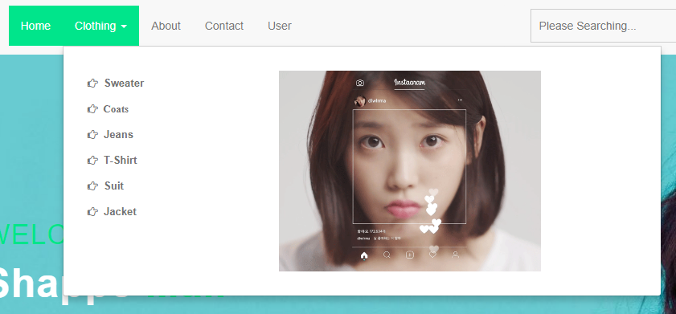

    1. 這裡是商品下拉選單，點進去即可到product page
    2. 右邊放的是gif動圖

    

    1. 這裡有五張特價的圖片，點進去是不同的產品
    2. 滑鼠移到圖上時會有css animation 慢慢放大圖片的效果

     

    
    1. 我總共有6個商品，這裡是商品列表
    2. 當滑鼠移到任一個商品上面時，圖片會有翻轉到背面的效果，變成新的圖
    3. css animation 會把Add to Cart慢慢從底線滑上來
    4. 加入購物車時會在右下角有Chrome通知

     
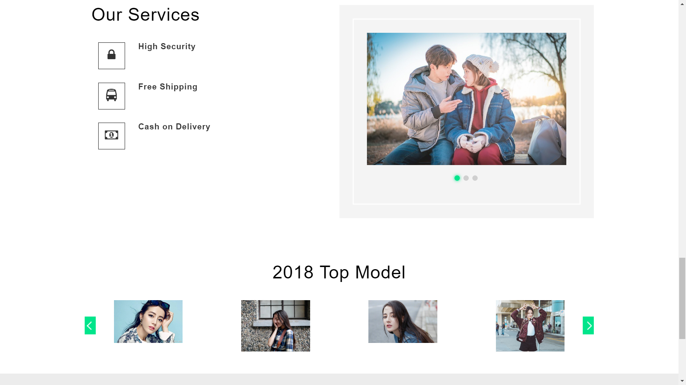
    
    1. 右邊是類似相框的效果，會隔段時間自動變換到下一張圖片，也可以手動點選下一張圖
    2. 下面是css animation，按左邊或右邊會慢慢滑到下一張圖片

* product page

    * 
    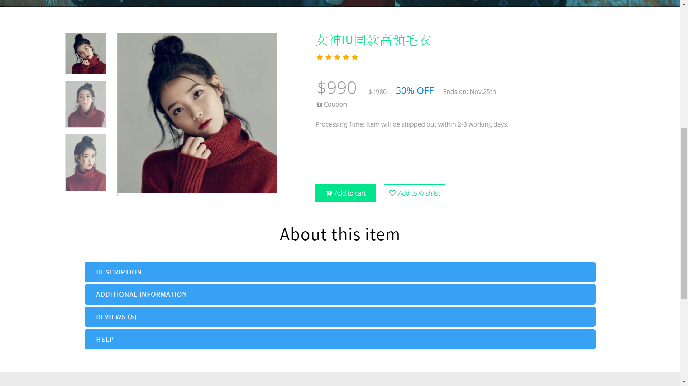
    
    1. 我總共有六個產品頁面，左邊會有不同的圖片可以切換
    2. 滑鼠移到圖片上右邊會顯示局部放大的效果
    3. 右邊add to cart可以加入購物車並且有通知
    4. 下面有四欄關於此產品的描述，點任一欄其他欄就會縮起來

* about page (Other functions)

    * 
    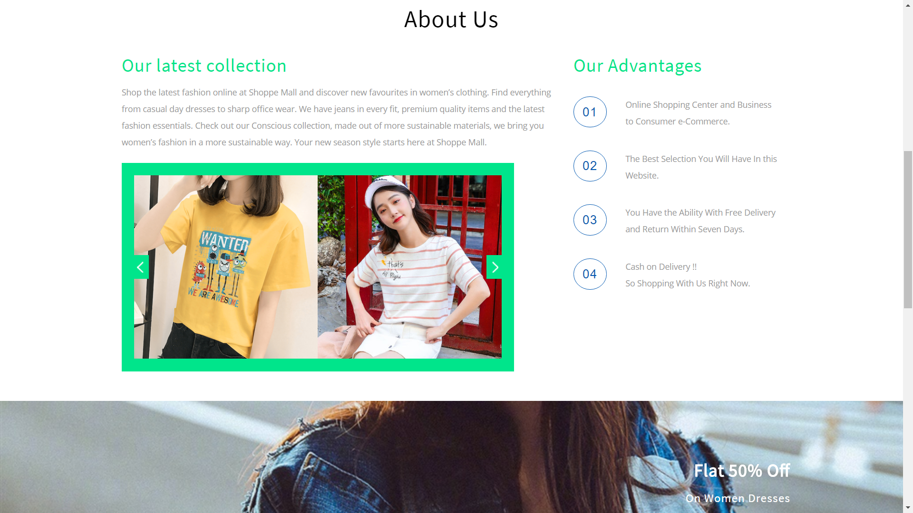
    
    1. 左邊的圖一樣有css animation，按左右會慢慢滑到下一張圖
    2. 右邊比較特別的是滑鼠移到數字上也會有翻一圈的效果，用css transition達到
    
     
 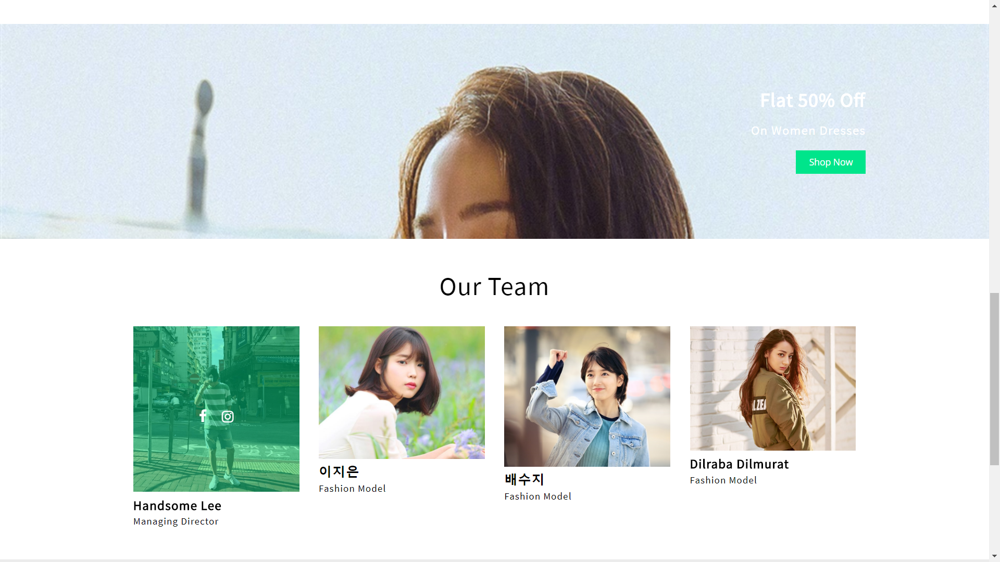
    
    1. 上面的圖是fixed的，所以會有背景牆的感覺，按shop now 會進到home頁
    2. 下面滑鼠移到圖上會有綠色方格翻轉cover原圖的效果，用css transform達到

* contact page (Other functions)

    * 
    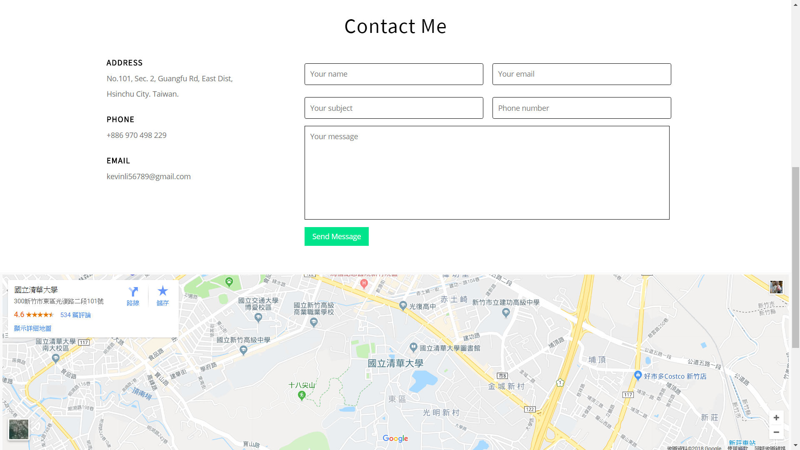
    
    1. 左邊是Address Phone Email
    2. Email的話點我帳號就可以直接寄信給我
    3. 右邊是send message，按下之後會有訊息通知
    4. 下面為google map嵌入

* shopping pipeline

    * 購物車彈窗及加入購物車通知

     
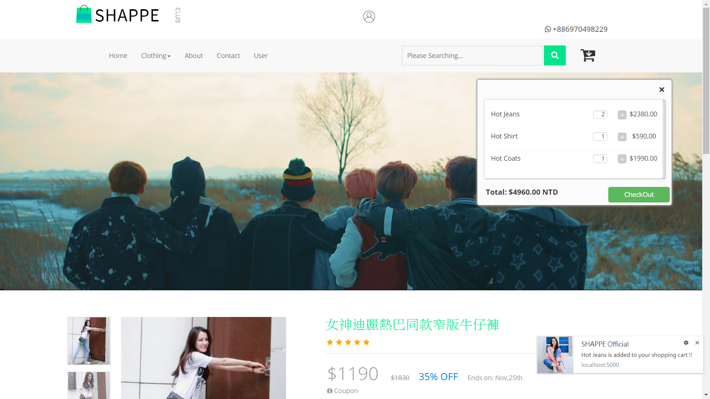
   
    1. 點一下右上角購物車就會跳出一個彈窗，顯示你現在購物車裡的商品
    2. 可以在彈窗內刪減商品及改變數量，total price會重算
    3. 按checkout 會進入 payment頁面，還沒登入時點擊checkout會有alert提醒要登入
    4. 只要加入任何商品進購物車，右下角都會顯示通知

    * 購買頁面及購買完成通知

    
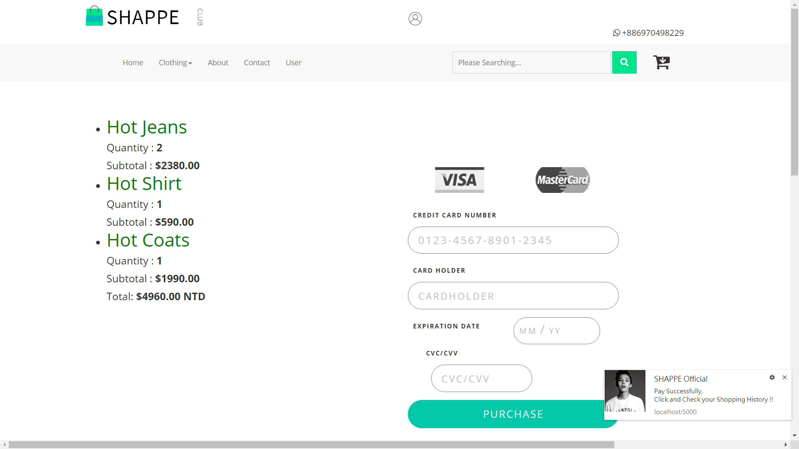

    1. 加入購物車的東西會在左邊條列顯示
    2. 右邊是付款方式及輸入卡號
    3. 按purchase後在右下角會有pay successfully的通知
    4. 必須登入才能付款，否則會有alert無法購買
    5. 成功後可以去user page查看紀錄

* user dashboard page

    * 
    

    1. 這裡會顯示目前使用者最近一次購買的Shopping History
    2. 包含日期、時間及商品數量
    3. 這些資訊同時也會read/write到我firebase的database

* footer (Other functions)

    * 
    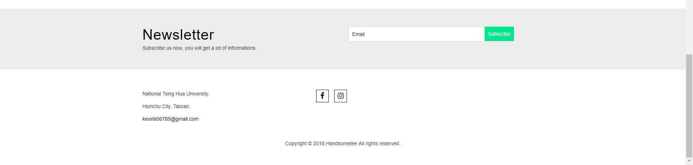

    * 這是每個頁面下面都有的
    1. newsletter可以填寫email
    2. 下面是關於我的一些資訊，點我的mail也可以直接寄信給我

* RWD

    1. 我使用了@media 調整20種不同的螢幕大小
    2. 從最大寬度1440px到320px都有考慮進去
    3. 所以不同的裝置排版會變而且都可以正常使用

## Security Report (Optional)

*   我deploy在gitlab的網址為https://105062333.gitlab.io/Midterm_Project/
    ，前面是https代表這個網站是安全的，可以說是加密過的http，
   HTTPS 是一種網際網路通訊協定，可確保資料在使用者的電腦和網站之間傳輸時，保有完整性和機密性。
   HTTPS 還會透過TLS通訊協定提供 加密、資料完整性、驗證 來確保網站安全，
   使用SSL加密確保了所有在伺服器與瀏覽器之間通過資料的私密性與完整性。

*   除了https外，還使用firebase Authentication，沒有註冊或登入的使用者是無法購買任何商品的，並且User Page只顯示目前使用者的資訊，無法竊取其他使用者的任何資料。

*   
* 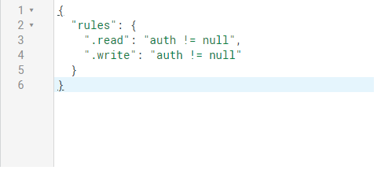
    
    *  代表如果沒有登入，是無法read/write firebase database，增加database的安全性。